# System Architecture Diagrams

> **Mermaid.js Diagrams** for DTL Mental Health Chatbot  
> Visualizations of multi-agent orchestration, data flow, and system components

---

## Table of Contents

- [Overview Architecture](#overview-architecture)
- [Multi-Agent Orchestration Flow](#multi-agent-orchestration-flow)
- [Three-Stage Pipeline](#three-stage-pipeline)
- [Tool Execution Sequence](#tool-execution-sequence)
- [Fitbit Integration Flow](#fitbit-integration-flow)
- [Memory System Architecture](#memory-system-architecture)
- [RAG Pipeline](#rag-pipeline)
- [Crisis Detection Flow](#crisis-detection-flow)
- [Database Schema](#database-schema)
- [Authentication Flow](#authentication-flow)
- [Component Hierarchy](#component-hierarchy)
- [Deployment Architecture](#deployment-architecture)

---

## Overview Architecture

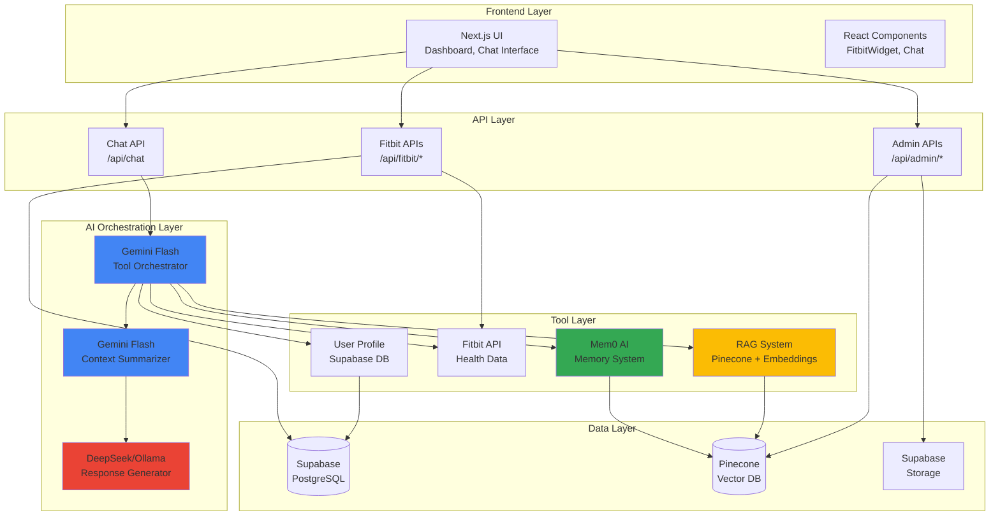

---

## Multi-Agent Orchestration Flow

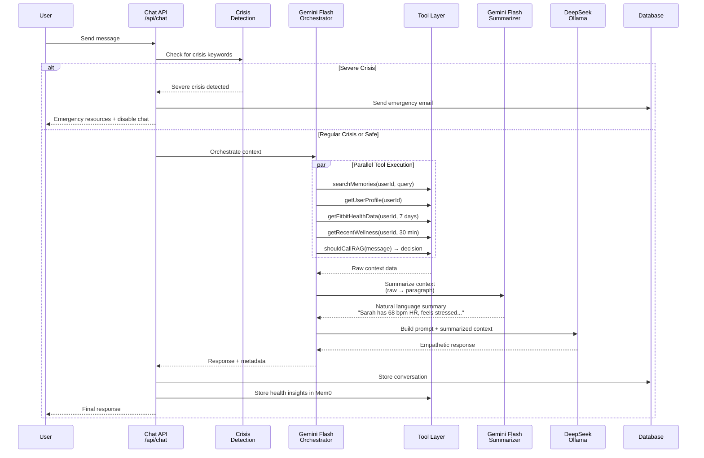

---

## Three-Stage Pipeline

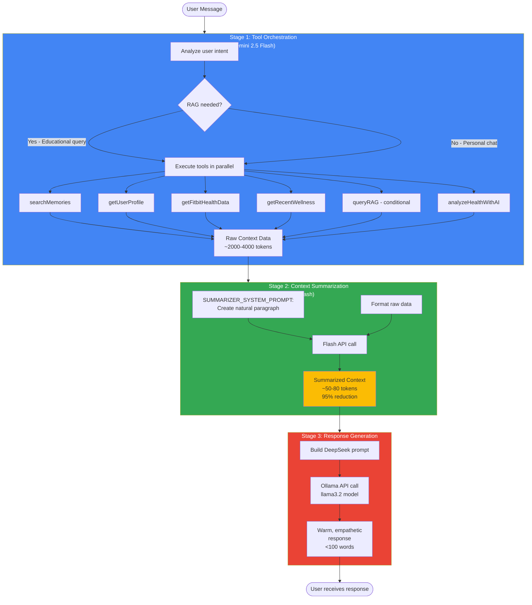

---

## Tool Execution Sequence

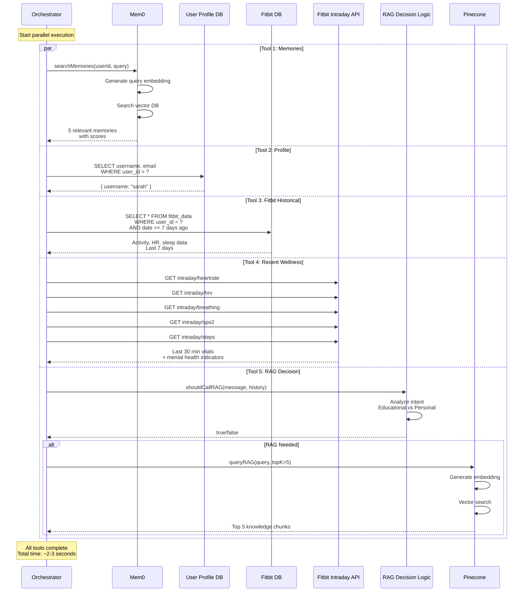

---

## Fitbit Integration Flow

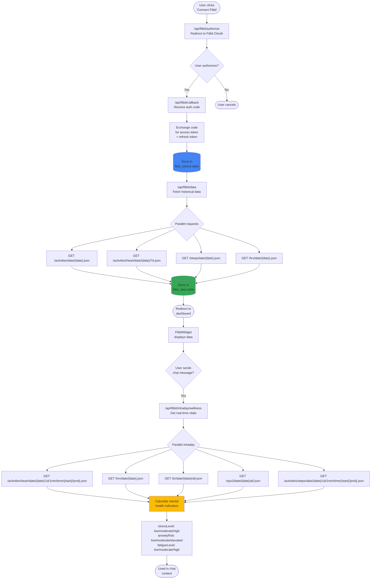

---

## Memory System Architecture

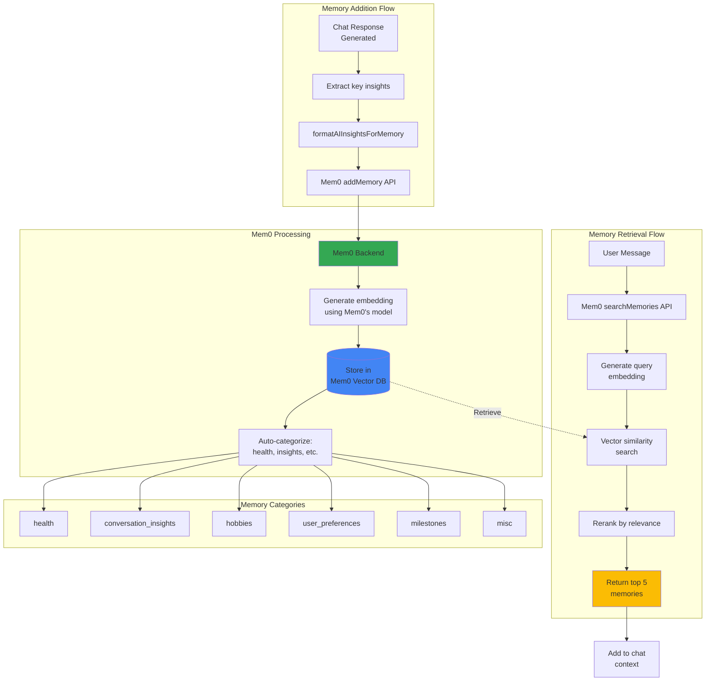

---

## RAG Pipeline

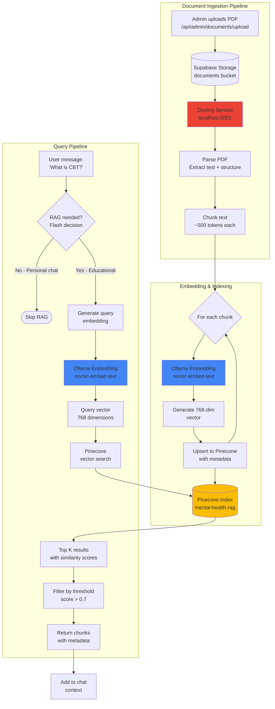

---

## Crisis Detection Flow

```mermaid
flowchart TD
    Message[User Message] --> DetectRegular{detectCrisis<br/>Check keywords}
    
    DetectRegular -->|"suicide", "hopeless"| RegularCrisis[Regular Crisis Flag]
    DetectRegular -->|Safe| DetectSevere{detectSevereCrisis<br/>Check severe keywords}
    
    DetectSevere -->|"kill myself tonight"<br/>"ending it all"| SevereCrisis[Severe Crisis Flag]
    DetectSevere -->|Safe| Continue[Continue normal<br/>chat flow]
    
    SevereCrisis --> CheckContact{Emergency<br/>contact linked?}
    
    CheckContact -->|Yes| SendEmail[Send emergency email<br/>via Resend API]
    CheckContact -->|No| SkipEmail[Skip email]
    
    SendEmail --> EmailContent["Email includes:<br/>- User name<br/>- Timestamp<br/>- Warning message<br/>- 988 hotline<br/>- Crisis resources"]
    
    EmailContent --> DisableChat[Disable chat input]
    SkipEmail --> DisableChat
    
    DisableChat --> ShowResources["Display prominent<br/>crisis resources:<br/>- 988 Lifeline<br/>- Crisis Text Line<br/>- Trevor Project"]
    
    ShowResources --> StopFlow([End chat session])
    
    RegularCrisis --> ContinueWithResources[Continue chat flow]
    ContinueWithResources --> AddResources[Append emergency<br/>resources to response]
    AddResources --> NormalResponse([Send response<br/>with resources])
    
    Continue --> NormalFlow([Normal chat response])
    
    style SevereCrisis fill:#ea4335,color:#fff
    style SendEmail fill:#fbbc04
    style RegularCrisis fill:#ff9800
```

---

## Database Schema

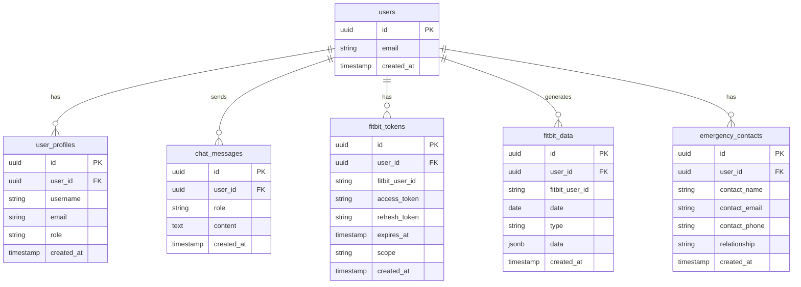

---

## Authentication Flow

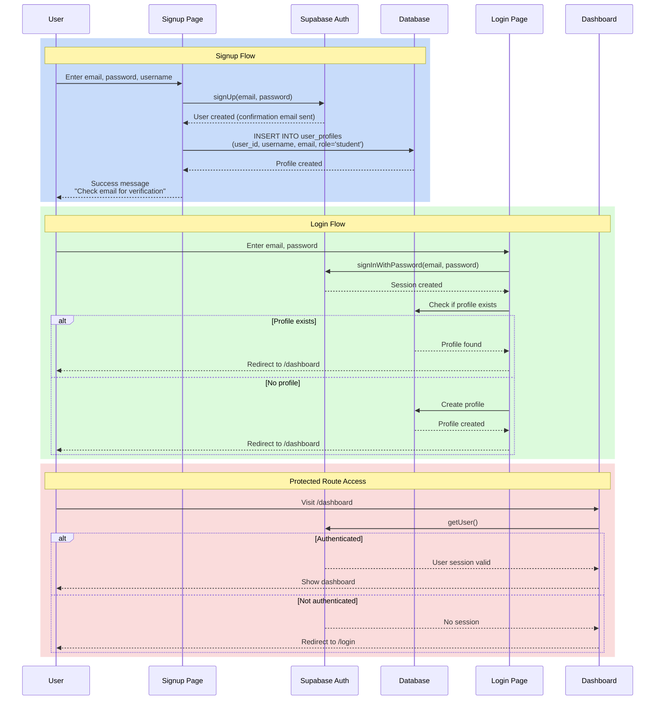

---

## Component Hierarchy

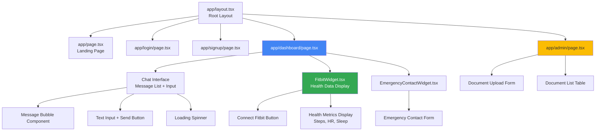

---

## Deployment Architecture

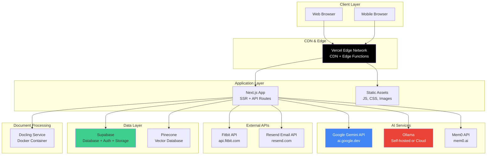

---

## Response Time Breakdown

```mermaid
gantt
    title Chat Request Timeline (Typical 10-12 second response)
    dateFormat X
    axisFormat %Ls
    
    section Auth & Validation
    Auth check           :0, 200ms
    Crisis detection     :200ms, 100ms
    
    section Stage 1: Orchestration
    Parallel tool calls  :300ms, 2500ms
    
    section Stage 2: Summarization
    Build raw context    :2800ms, 200ms
    Flash summarization  :3000ms, 1500ms
    
    section Stage 3: Generation
    Build DeepSeek prompt :4500ms, 100ms
    DeepSeek generation   :4600ms, 4000ms
    
    section Finalization
    Store conversation    :8600ms, 500ms
    Add memories         :9100ms, 300ms
    Return response      :9400ms, 100ms
```

---

## Error Handling Flow

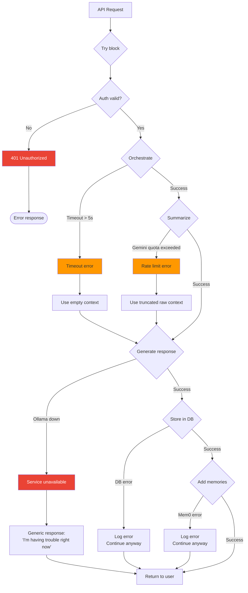

---

## Tool Selection Logic

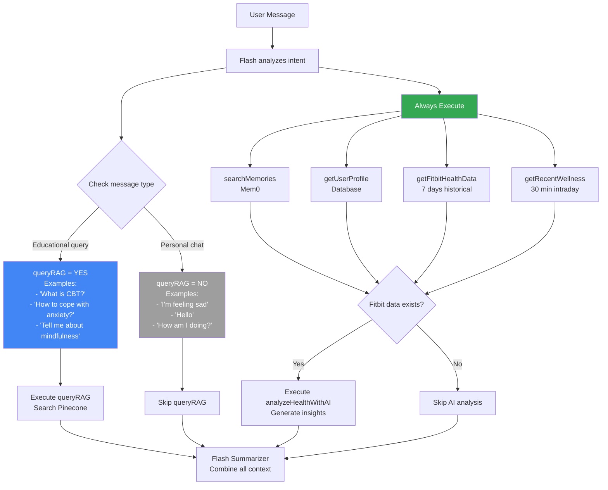

---

## Monitoring & Observability

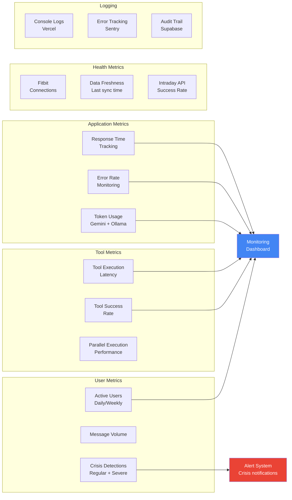

---

## How to Use These Diagrams

### In GitHub/GitLab
These Mermaid diagrams will render automatically in:
- GitHub README files
- GitLab documentation
- Notion (with Mermaid block)
- Obsidian (with Mermaid plugin)

### In Documentation Sites
Use tools like:
- **Docusaurus**: Native Mermaid support
- **VitePress**: Mermaid plugin
- **MkDocs**: Mermaid2 plugin

### Export as Images
Use online tools:
- https://mermaid.live - Render and export as PNG/SVG
- https://mermaid.ink - Generate image URLs

### In Presentations
- Export diagrams as SVG
- Import into Google Slides, PowerPoint, or Keynote
- Maintain vector quality for scaling

---

**Built for the DTL Mental Health Chatbot**  
*Visualizing the multi-agent AI architecture*
